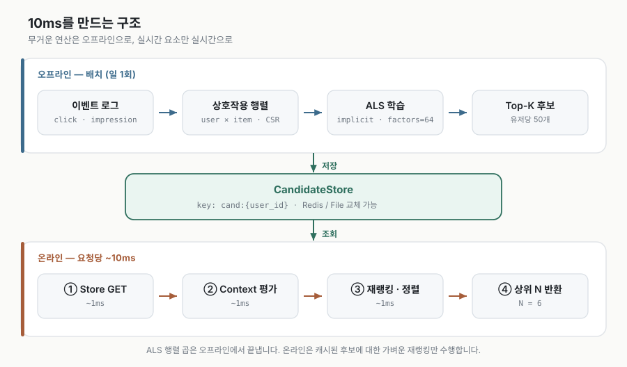

# UZET — ALS 기반 개인화 위젯 추천 엔진

> 원본은 2025.10~12 2인 팀 프로젝트로 진행했으며, 본 레포는 당시 제가 담당한
> 추천 엔진 파트를 개인 학습 목적으로 **재구현**한 것입니다.
> 실서비스 로그는 사용할 수 없어 페르소나 기반 합성 데이터로 대체했습니다.


---

## 무엇을 푸는가

금융 앱의 메뉴는 깊습니다. 자주 쓰는 기능이 5-Depth 안쪽에 있으면 사용자는
같은 경로를 매번 헤맵니다. 그렇다고 모든 기능을 첫 화면에 늘어놓으면 아무것도
눈에 안 들어옵니다.

**질문: 이 사용자가 _지금_ 쓸 확률이 높은 기능 N개를 어떻게 고를까?**

신호는 두 종류입니다.

| 신호 | 성격 | 예시 | 담당 |
|---|---|---|---|
| 장기 선호 | 느리게 변함 | 이 사람은 평소 환전을 자주 쓴다 | Implicit ALS |
| 단기 맥락 | 빠르게 변함 | 지금은 급여일, 지금은 장중 | 규칙 기반 부스팅 |

둘을 하나의 스코어로 합칩니다.

```
final_score(u, w, ctx) = α·ALS_norm(u,w) + β·Context(w,ctx) + γ·Recency(u,w) − δ·Fatigue(u,w)
```

가중치 α~δ는 전부 [`config/scoring.yaml`](config/scoring.yaml)에 있습니다.
코드에 하드코딩된 튜닝 값은 없습니다.

---

## 왜 Implicit ALS인가

사용자는 위젯에 별점을 주지 않습니다. 클릭했거나 안 했거나뿐입니다.
암묵적 피드백(implicit feedback)에는 명시적 평점 알고리즘을 그대로 쓸 수 없습니다.

1. **부정 신호가 없다.** 클릭 안 한 게 "싫어서"인지 "몰라서"인지 구분 불가
2. **결측이 아니라 0이다.** 안 본 항목이 압도적 다수라 희소 행렬이 됨

Hu-Koren-Volinsky(2008)는 이걸 선호와 신뢰도로 분해합니다.

```
선호   p_ui = 1 if r_ui > 0 else 0
신뢰도 c_ui = 1 + α · r_ui
```

"클릭 0 → 선호 0이지만 확신은 약함", "클릭 50 → 선호 1이고 확신이 강함"으로
다룹니다. 손실 함수에 **관측되지 않은 0까지 전부 포함**되는 게 explicit MF와의
결정적 차이입니다. ALS를 택한 건 한쪽 행렬을 고정하면 다른 쪽이 닫힌 해를 갖는
최소제곱 문제가 되어 이 계산이 병렬화되기 때문입니다.

---

핵심은 **런타임에 모델을 돌리지 않는 것**입니다.

<picture>
  <source media="(prefers-color-scheme: dark)" srcset="docs/images/architecture-dark.svg">
  
</picture>

"추천을 실시간으로 계산한다"가 아니라 "실시간 요소만 실시간으로 반영한다"입니다.

저장소는 인터페이스로 추상화해 파일 캐시와 Redis를 바꿔 끼울 수 있습니다
([`src/store/candidate_store.py`](src/store/candidate_store.py)).
Redis 없이도 개발과 테스트가 되고, 같은 계약 테스트를 두 구현에 돌립니다.

신규 유저용 폴백 함수의 연결은 아직 구현되지 않았으며, 현재 API는 후보가 없는 사용자에게 HTTP 501을 반환합니다.

---

## 실행 절차와 현재 상태

아래는 목표 실행 흐름입니다. 현재 핵심 함수에 `NotImplementedError`가 남아 있어 학습·후보 생성·추천 전체 흐름은 완료되지 않았습니다.

### 명령

```bash
pip install -r requirements.txt

# 1. 합성 로그 생성
python -m src.datagen.log_generator --n-users 2000 --days 60

# 2. 학습 + 후보 사전계산
python -m src.batch.precompute --backend file

# 3. 서빙
uvicorn src.api.main:app --reload
```

```bash
# 평일 장중 → 투자 위젯이 위로
curl "http://localhost:8000/recommend/u000001?now=2025-10-15T10:30:00"

# 급여일 → 월급관리/적금이 위로
curl "http://localhost:8000/recommend/u000001?now=2025-10-25T10:00:00"

# 로밍 중 → 환전/해외송금이 위로
curl "http://localhost:8000/recommend/u000001?is_roaming=true"
```

응답의 `parts` 필드에 항별 기여도가 들어 있어 **왜 이 순서인지** 확인할 수 있습니다.

```bash
pytest                 # 전체
pytest -m redis        # Redis 구현 (로컬 Redis 필요)
```

---

## 평가 상태

공개 저장소에는 평가 지표를 계산하기 위한 설계와 테스트가 있지만, 완성된 실험 결과는 없습니다. 추천 정확도 향상, 응답 시간, CTR 개선을 성과로 주장하지 않습니다.

평가 시 유저별 시간상 마지막 클릭을 홀드아웃하고 Recall@10, NDCG@10, Coverage@10을 함께 비교할 계획입니다. 성능 측정에는 데이터 규모·하드웨어·동시 요청 수·커밋을 함께 기록해야 합니다.

## 구현 상태

| 영역 | 현재 공개 코드 |
| --- | --- |
| 구성 | 설정 로딩, 데이터 생성 코드, 파일 저장소, FastAPI 경로와 테스트 구성 |
| ALS / 배치 | 핵심 학습·후보 사전 계산 함수 미구현 |
| 점수화 | Context 규칙 평가와 하이브리드 점수 핵심 함수 미구현 |
| 저장소 | Redis 쓰기·조회 함수 미구현 |
| 신규 사용자 | 콜드 스타트 폴백 연결 미구현, API에서 501 반환 |
| 평가 / 데모 | 지표 계산 함수와 데모 결과 렌더링 미구현 |

위 아키텍처는 목표 설계입니다. 이 저장소는 완성된 추천 서비스가 아니라 **개인 재구현·학습 프로젝트**로 소개합니다.

## 알려진 한계

현재 범위와 검증 제약입니다.

- **합성 데이터입니다.** 페르소나로 심어 넣은 구조를 모델이 되찾는 구성이라
  실제 사용자 행동의 복잡도(계절성, 이벤트, 유저 취향 변화)는 없습니다.
- **Context 규칙은 하드코딩된 도메인 지식입니다.** 데이터로 학습한 게 아닙니다.
  규칙 수가 늘면 상호작용을 사람이 관리하기 어려워집니다. 다음 단계는
  규칙을 피처로 넣은 랭킹 모델(LambdaMART 등)입니다.
- **실측 평가 결과가 없습니다.** 실제 CTR 개선은 A/B 테스트 없이는 알 수 없습니다.
- **급여일을 25일 고정**으로 두었습니다. 실제로는 유저별로 다르고, 입금 내역에서
  추정해야 합니다.

---

## 구조

```
config/     personas.yaml · widgets.yaml · scoring.yaml   ← 모든 튜닝 값
src/
  datagen/  합성 로그 생성기
  model/    ALS 학습 · 평가 지표
  scoring/  Context 규칙 엔진 · 하이브리드 스코어러
  store/    후보 저장소 (파일 / Redis)
  batch/    오프라인 파이프라인
  api/      FastAPI 서빙
tests/      계약 테스트
docs/       구현순서.md · evaluation.md
```

## 참고

- Hu, Koren, Volinsky (2008), *Collaborative Filtering for Implicit Feedback Datasets*
- [`implicit`](https://github.com/benfred/implicit) 라이브러리
